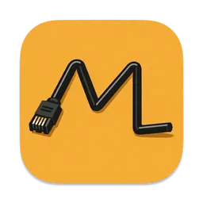
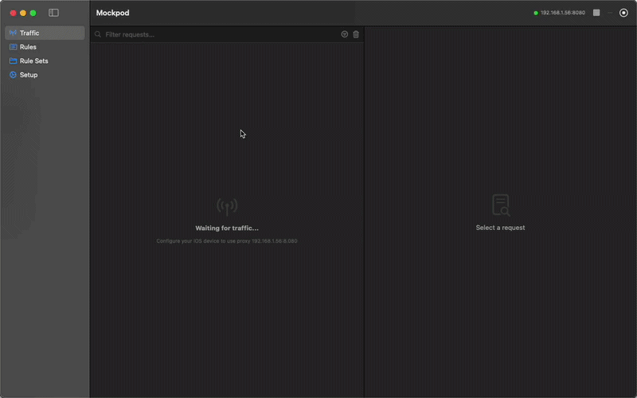

<div align="center">
  
</div>
<h1 align="center">Mockpod</h1>

<p align="center">
  <strong>Mockpod is a powerful network interception and mocking tool designed for macOS users. </strong>
</p>

<p align="center">
  Built for Developer, QA and Security Researcher
</p>

<p align="center">
  
</p>

# What is Mockpod?

**A powerful network interception and mocking tool for macOS users.**

Mockpod is a local proxy server that lets you inspect, modify, and mock HTTP/HTTPS traffic in real-time. It's ideal for testing edge cases, simulating backend failures, and developing frontend applications without a fully functional backend API.

## 📦 Installation

### Option 1: Install via Homebrew (Recommended)

```bash
brew install --cask sinanerdinc/tap/mockpod
```
Note: To update Mockpod to the newest version in the future, simply run:

```bash
brew upgrade --cask mockpod
```

### Option 2: Manual Download

If you prefer not to use Homebrew, you can manually download the latest .dmg file:

**📥 [Download the latest release from GitHub](https://github.com/sinanerdinc/mockpod/releases/latest)**

### ⚠️ Important: First Launch

Since Mockpod is an open-source tool distributed outside the Mac App Store, macOS Gatekeeper may quarantine it upon the first launch. If the app fails to open or macOS displays a warning, simply run the following command in your Terminal to remove the quarantine flag:

```bash
xattr -cr /Applications/Mockpad.app
```

After running the command, right-click the Mockpod app and select Open. macOS will remember your choice, and you can launch it normally from then on.

---

## 🛠 Development & Build from Source

This project uses `xcodegen` to generate the Xcode project file dynamically. This keeps the repository clean and avoids `.xcodeproj` merge conflicts.

### Requirements
- **macOS** 14.0 (Sonoma) or later
- **Xcode** 16.0 or later
- **Swift** 5.10 or later

### Build Steps

1. **Clone the repository**
   ```bash
   git clone https://github.com/sinanerdinc/mockpod.git
   cd mockpod
   ```

2. **Install XcodeGen** (If you don't have it)
   ```bash
   brew install xcodegen
   ```

3. **Generate the Xcode project and open it**
   ```bash
   xcodegen
   open Mockpod.xcodeproj
   ```

> **💡 Tip for Contributors:** When building locally, you may need to go to your target's **Signing & Capabilities** tab in Xcode and select your personal Apple ID team to successfully compile the app.

---

## 💻 Usage

1. **Launch Mockpod** – Open the application.
2. **Configure proxy settings** – Point your system or browser proxy to the local server (default port is usually `8080`).
3. **Create a Rule Set** – Define how specific requests should be intercepted and mocked.
4. **Start the proxy** – Begin intercepting traffic.
5. **Pin important requests** – Right-click any traffic entry and select **Pin** to keep it at the top of the list. Pinned entries are preserved when clearing traffic.

---

## 🤝 Contributing

We welcome contributions! Here's the standard workflow:

1. **Fork** the repository.
2. Create a new **branch**: `git checkout -b feature/my-awesome-feature`
3. **Commit** your changes: `git commit -m 'Add some awesome feature'`
4. **Push** to the branch: `git push origin feature/my-awesome-feature`
5. Open a **Pull Request**.

*Please remember to run `xcodegen` and verify the project builds successfully locally before submitting a PR.*

---

## 📄 License

This project is licensed under the MIT License. See the [LICENSE](LICENSE) file for details.
